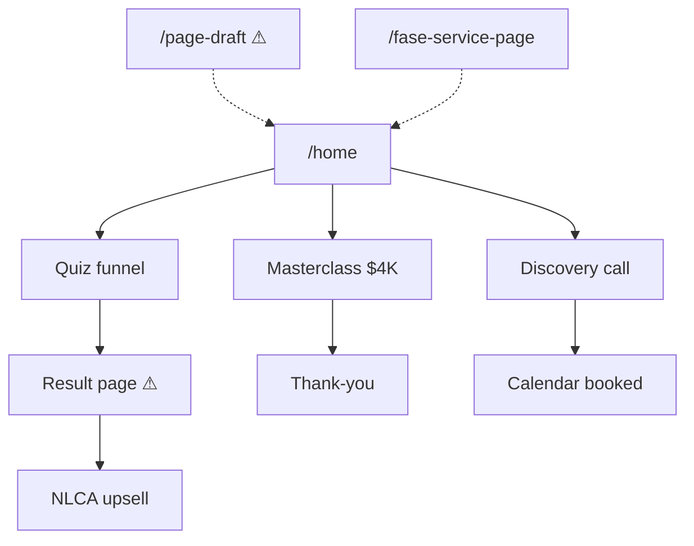

# Full Arch Sales Experts (FASE)
## Digital Infrastructure & Funnel Audit
**Prepared for:** Stacy Farley / Full Arch Sales Experts  
**Prepared by:** Louie Cervera
**Date:** June 16, 2026  
**Domain:** https://fullarchsalesexperts.com  
**Platform:** GoHighLevel (GHL)  
**Audit window:** Apr 16 – Jun 16, 2026 (audit logs + live crawl)

---

## Executive Summary

FASE runs an active, high-value dental training business with real traction: **216 new contacts** and **88 opportunities** in the last 60 days, plus a heavy calendar of client team trainings (Smile Solutions, Lunova, MDI, DCIS, and others). The brand, offer stack, and social proof are strong.

What is costing them leads and credibility right now is **broken digital infrastructure** — not messaging strategy:

| Severity | Issue | Business impact |
|----------|-------|-----------------|
| **P0** | NLCA Revenue Audit result page shows **demo mode** and unreplaced `${gapHeadline}` template | Lead magnet delivers a broken report → kills NLCA conversions |
| **P0** | `/page-draft` is **publicly live** | Unfinished draft indexed and shareable |
| **P1** | Homepage contains **"home lending products"** copy (wrong industry) | Immediate credibility hit on $4K offer |
| **P1** | Duplicate live pages (2× service, 2× privacy, 2× audit squeeze, 2× booking) | SEO dilution, analytics split, maintenance chaos |
| **P1** | `sitemap.xml` returns **500 error**; `robots.txt` is empty | Search engines can't crawl systematically |
| **P1** | Masterclass checkout shows **$0.00 order total** + shipping fields on digital course | Checkout confusion / abandoned carts |
| **P2** | Multiple headline spacing/typo issues across funnel pages | Looks unpolished for a premium coaching brand |
| **P2** | Homepage HTML is **1.09 MB** | Slow mobile load = lost ad traffic |

**Bottom line for re-engagement:** FASE doesn't need a rebrand. They need a **digital ops partner** who owns GHL funnel health, fixes the NLCA lead engine, puts pages under version control, and prevents regressions while their team scales client trainings.

---

## Site Map (Live Crawl — 19 URLs)

Root `https://fullarchsalesexperts.com/` redirects to `/home`.

### Primary funnel & conversion paths

| Path | Title / Purpose | Size | Status |
|------|-----------------|------|--------|
| `/home` | Full Arch Sales Masterclass — main homepage | 1,092 KB | Live — **issues** |
| `/fase-service-page` | Stacy services hub (Masterclass + NLCA + Discovery) | 160 KB | Live — best page |
| `/full-arch-growth-system` | Alternate growth/training landing page | 128 KB | Live |
| `/page-draft` | **Draft homepage variant** | — | **PUBLIC (should not be)** |
| `/ncla-quiz-funnel` | NLCA Revenue Audit — 5-question quiz | 265 KB | Live — **issues** |
| `/ncla-squeeze-page-1` | Duplicate of quiz funnel entry | 265 KB | Live — consolidate |
| `/ncla-result-page` | Personalized audit report | 282 KB | **BROKEN** |
| `/nextlevel-124405` | NLCA membership order page | 229 KB | Live — missing title tag |
| `/course-641943` | Masterclass $4,000 checkout | 307 KB | Live — checkout issues |
| `/discovery-call` | Calendar booking | 140 KB | Live |
| `/booking` | Duplicate of discovery-call | 140 KB | Consolidate |
| `/thank-you` | Post-purchase thank you | 120 KB | Live |

### Supporting pages

| Path | Title / Purpose | Size | Status |
|------|-----------------|------|--------|
| `/service-page` | Services listing | 57 KB | Duplicate |
| `/service-page-555902` | Services listing (clone) | 57 KB | Duplicate |
| `/result-page-4799-page` | Case studies | 83 KB | Live |
| `/privacy-policy` | Privacy policy | 88 KB | Duplicate |
| `/privacy-policy-page` | Privacy policy (clone) | 88 KB | Duplicate |
| `/terms-of-use` | Terms of use | 90 KB | Live |

### Infrastructure

| Resource | Status |
|----------|--------|
| `/sitemap.xml` | **500 Internal Server Error** |
| `/robots.txt` | Empty (no crawl directives) |

### Funnel map (user journey)



Primary paths from `/home`. Dashed lines: alternate entries (`/page-draft`, `/fase-service-page`). URL dupes: `/ncla-squeeze-page-1`, `/booking`.

---

## Content Audit — Page by Page

### `/home` — P0 + P1

**What's working**
- Strong Dr. Feffer letter, module breakdown, video testimonials
- Clear dual offer: Masterclass ($4K) vs Discovery Call
- Good meta description for SEO

**Critical issues**
1. **Wrong industry copy** in Masterclass section: *"Explore our diverse range of home lending products and services tailored to fit your unique needs and goals."* — clearly pasted from another template. Fatal on a dental sales page.
2. **Page weight: 1.09 MB HTML** — will hurt mobile PageSpeed and ad landing quality scores.

**Retracted (false positive on re-check)**
- ~~Animated stat counters stuck at zero~~ — counters **start at 0% on page load** and animate to **70% conversion / 50+ arches / 5% marketing spend** once the proof section (`#section-lq1-mNj5zP`) scrolls into view. Initial audit checked load state without scrolling; live Playwright re-test confirmed animation after viewport entry.

**Minor UX note (P2, not broken)**
- Proof counters are below the fold and show 0% until scroll. Users who never reach that section only see zeros in the DOM — consider static fallback numbers or triggering animation earlier.

**Fix now**
- Replace lending copy with dental-appropriate CTA copy
- Compress/remove unused builder sections

---

### `/ncla-quiz-funnel` + `/ncla-squeeze-page-1` — P1

**What's working**
- Strong hook: "Your consult process has a leak"
- 5-question audit is well structured for dental operators
- Good consent checkboxes for TCPA compliance
- Tags in GHL (`nlca-audit`, `may intro`, `nlca session a/b`) show active campaign use

**Issues**
1. **Headline spacing broken**: "hasa leak" / "exactlywhere" (missing spaces)
2. **Question counter bug**: shows "Question 11 of 5", "Question 22 of 5" (duplicate digit rendering)
3. **Two live entry URLs** for same funnel — split attribution in ads/analytics
4. `${gapHeadline}` template literal present in HTML source (leaks into page if JS fails)

**Fix now**
- Consolidate to single canonical URL: `/ncla-quiz-funnel`
- Fix headline text and question step counter in builder
- 301 redirect squeeze page variant

---

### `/ncla-result-page` — P0 (highest priority)

**Live behavior when visited without quiz data:**
> "Demo mode — showing a sample report. Custom values not detected. Ensure your GHL contact has quiz fields populated, or pass answers via URL parameters (?q1=...&q2=...&q3=...&q4=...&q5=...)."

**H1 renders as:** `${gapHeadline}`

**Root cause (likely)**
- Custom values / contact fields from quiz not mapped to result page dynamic text
- Workflow not passing quiz answers via URL params or custom fields on form submit
- Result page JavaScript falls back to demo mode for all cold traffic

**Business impact**
This is FASE's **top-of-funnel lead magnet** for NLCA ($295/mo recurring). Every prospect who completes the quiz and lands here sees a broken/generic report instead of personalized revenue gap analysis. This is direct lost NLCA revenue.

**Fix now**
1. Map all 5 quiz answers to GHL custom fields on form submit
2. Wire result page dynamic sections to those fields (or URL params)
3. Remove demo mode banner from production
4. Test end-to-end: ad click → quiz → form → result page → NLCA CTA
5. Add workflow tag `nlca-audit-complete` only after successful personalization

---

### `/fase-service-page` — Best page on the site

**What's working**
- Clean service hierarchy: Masterclass / NLCA / Discovery Call
- Strong proof numbers (70%+, 50+ arches, 5% marketing, 20+ years)
- NLCA pricing clear ($295/mo, $2,950/yr)
- Testimonials with revenue outcomes ($989K, conversion doubled)

**Issues**
1. Minor spacing: "YourFull-Arch Consults.Every Time."
2. Placeholder still visible: `[Replace with Stacy's headshot]`
3. Audit log shows **empty head/body tracking codes** on funnel settings (no pixels at funnel level)

**Fix now**
- Replace headshot placeholder
- Add Meta Pixel + GA4 at funnel settings level
- Fix headline spacing

---

### `/course-641943` — Masterclass checkout — P1

**Issues**
1. **Order total displays $0.00** while line item shows $4,000
2. **Shipping address form** on a digital course — unnecessary friction
3. Copyright footer says **© 2025** (rest of site says 2026)

**Fix now**
- Remove shipping step for digital-only product
- Fix order summary total calculation
- Update copyright year

---

### `/nextlevel-124405` — NLCA order page — P2

**Issues**
1. **Empty `<title>` tag** — bad for SEO and tab bookmarks
2. Spacing issues: "leavingcases", "largestsingle-owned", "salesleadership"
3. Counter stats may show zeros (flagged in HTML export)

**Fix now**
- Add title: "Next Level Case Acceptance — Full Arch Sales Experts"
- Fix text spacing in builder

---

### `/discovery-call` + `/booking` — P2

Identical pages (140 KB each). Pick one canonical URL, 301 the other.

---

### Duplicate pages — P1

| Canonical (keep) | Retire / 301 |
|------------------|--------------|
| `/service-page-555902` | `/service-page` |
| `/privacy-policy` | `/privacy-policy-page` |
| `/ncla-quiz-funnel` | `/ncla-squeeze-page-1` |
| `/discovery-call` | `/booking` |

---

### `/page-draft` — P0 security/content issue

Audit logs show funnel settings created for `Page Draft` at path `/page-draft` on Jun 7, 2026 (Salv Muralla). This draft is **publicly accessible** and contains a polished alternate homepage with a lead form.

**Risk:** Google indexes it, team shares wrong URL, A/B confusion with `/home`.

**Fix now:** Unpublish or password-protect immediately. Decide: merge improvements into `/home` or delete.

---

## GHL Audit Log Analysis (Apr 16 – Jun 16, 2026)

**Source:** `Export_Audit_Logs__Jun_2026_10_12_AM.csv` (3,980 events)

### Activity breakdown

| Module | Events | Notes |
|--------|--------|-------|
| CONTACT | 3,127 | Core CRM activity |
| CALENDAR_EVENT | 696 | Heavy training schedule |
| OPPORTUNITY | 115 | Pipeline movement |
| FUNNELS | 8 | Site edits (low volume = stale pages?) |
| Other | 34 | Tags, pipelines, custom fields |

### CRM velocity (60 days)

- **216 contacts created**
- **88 opportunities created**
- Active tags: `discovery call booked`, `nlca-audit`, `nlca session a/b`, `nlca monthly`, `nlca member`, `full arch sales masterclass order paid`, `may intro`

### Funnel edit history (who changed what)

| Date | Editor | Change |
|------|--------|--------|
| Jun 7 | Salv Muralla | Page Draft settings updated |
| Jun 5 | Salv Muralla | Service Page updated |
| Jun 2 | Salv Muralla | Full Arch Growth System + FASE-Service Page settings |
| May 13 | (system) | NCLA Squeeze page URL changes |
| May 12 | (system) | NCLA Quiz Funnel + Result Page configured |

**Observation:** Only 8 funnel events in 60 days while CRM/calendar is extremely active. Site is not being maintained at the same pace as client delivery. Edits are concentrated in one contractor (Salv Muralla) with no visible QA pass before publish.

### Training calendar (proof of active client ops)

Top recurring events in audit window:
- Smile Solutions Training (34 events)
- The Implant Center Team Training (16)
- Lunova Dental Implant Center Team Training (16)
- MDI Team Training (14)
- FASE Ops / Marketing Meetings (22 combined)
- Multiple practice-specific onboardings (FAGA, DCIS, Graf Dental, etc.)

**This is the hook:** FASE is scaling client delivery fast. Their **marketing infrastructure isn't keeping up**.

---

## Technical / SEO Audit

| Check | Result | Priority |
|-------|--------|----------|
| sitemap.xml | 500 error | P1 |
| robots.txt | Empty | P2 |
| Homepage meta description | Present | OK |
| Multiple pages missing meta description | service, privacy, fase-service | P2 |
| Duplicate titles (booking/discovery) | Yes | P2 |
| Page-draft indexed risk | High | P0 |
| GHL tracking codes on FASE-Service funnel | Empty per audit log | P1 |
| Homepage page weight | 1.09 MB | P1 |
| Custom domain SSL | Active | OK |

---

## GitHub Transfer — How to Version-Control GHL Pages

GHL has **no native export** to external platforms. The supported approach for audit + backup:

### What was done

1. **HTML snapshot export** of all 17 live pages → `site-export/html/`
2. **Sitemap manifest** → `site-export/audit/sitemap.json`
3. **Automated content flag scan** → `site-export/audit/content-flags.json`
4. **Reusable export script** → `export-to-github.ps1`

### Push to GitHub (run these commands)

```powershell
cd C:\Users\Louie\Downloads\fase-github-export\site-export
git init
git add .
git commit -m "FASE site snapshot — Jun 2026 audit baseline"
gh repo create fase-site-archive --private --source=. --push
```

Or push to an existing repo:

```powershell
git remote add origin https://github.com/YOUR_ORG/fase-site-archive.git
git push -u origin main
```

### Recommended repo structure

```
fase-site-archive/
├── html/                    # Rendered HTML per page (read-only archive)
├── audit/
│   ├── sitemap.json         # URL inventory
│   └── content-flags.json   # Automated issue detection
├── exports/
│   └── audit-logs/          # Drop GHL CSV exports here
├── export-to-github.ps1     # Re-run monthly for diff
└── README.md
```

### Ongoing workflow (what you'd deliver as their partner)

1. **Weekly:** Re-run `export-to-github.ps1` → git diff shows exactly what changed on live site
2. **On every funnel edit:** Export GHL audit logs CSV → commit to `exports/audit-logs/`
3. **Before campaigns:** Run content-flags scan — catch template literals, wrong copy, zero stats
4. **For rebuilds:** HTML archive is reference only; rebuild in GHL builder, not from HTML

### Limitations (be upfront with client)

- HTML export is **rendered output**, not editable GHL builder JSON
- Forms, workflows, calendars, and payment connections **do not export**
- For full GHL-to-GHL backup, use **Snapshots** inside GHL
- For front-end migration packages, third-party tools like ExportGHL exist (not official)

---

## Prioritized Fix List (No Weekly Plan — Just Do This)

### Today (P0 — revenue blockers)

1. **Fix `/ncla-result-page`** — map quiz fields, kill demo mode, test full funnel
2. **Remove wrong "home lending" copy** on `/home`
3. **Unpublish `/page-draft`** or redirect to `/home`

### This week (P1 — trust + SEO)

5. Consolidate 4 duplicate URL pairs (301 redirects)
6. Fix `sitemap.xml` 500 error in GHL site settings
7. Fix Masterclass checkout ($0 total, remove shipping)
8. Fix quiz headline spacing + question counter ("11 of 5")
9. Add Meta Pixel + GA4 to funnel head tracking (FASE-Service Page settings are empty)
10. Compress `/home` page (1 MB → target under 400 KB)

### Next (P2 — polish)

11. Replace Stacy headshot placeholder on service page
12. Add missing `<title>` on NLCA order page
13. Fix spacing typos across NLCA and service pages
14. Populate `robots.txt` + submit sitemap to Google Search Console
15. Set up GitHub archive repo + monthly diff process

---

## Re-Engagement Pitch — Why They Need You Back

### The story to tell Stacy

> "Your content and coaching are working — 216 new leads and a packed training calendar prove it. But your NLCA audit funnel, which should be your best NLCA enrollment engine, is delivering a broken report. And you have a draft page live that anyone can find on Google.
>
> You're scaling client trainings across dozens of practices, but the marketing site isn't getting the same operational discipline. That's not a content problem — it's a **digital ops gap**.
>
> I can own this: fix the broken funnel, consolidate duplicate pages, put everything in GitHub so you always have a backup and change history, and run QA before anything goes live — so your team can focus on what they do best: closing cases and training dental teams."

### Service package framing

| Deliverable | Value to FASE |
|-------------|---------------|
| **Funnel health retainer** | P0 fixes + monthly crawl/diff against GitHub archive |
| **NLCA engine ownership** | Quiz → result → NLCA conversion path monitored and optimized |
| **GHL audit log reviews** | Catch accidental publishes, deletions, untracked edits |
| **Campaign launch QA** | Test forms, tags, workflows before ad spend goes live |
| **Performance + SEO** | sitemap, page weight, meta tags, duplicate cleanup |

### Proof you already did the work

- Full site crawl: **19 URLs** mapped
- **17 HTML snapshots** archived locally, ready for GitHub
- **3,980 audit log events** analyzed
- **11 specific broken elements** identified with URLs and reproduction steps
- Export automation script built and tested

---

## Files Delivered

| File | Location |
|------|----------|
| This audit report | `C:\Users\Louie\Downloads\fase-github-export\FASE-DIGITAL-AUDIT-REPORT.md` |
| HTML export (17 pages) | `C:\Users\Louie\Downloads\fase-github-export\site-export\html\` |
| Sitemap JSON | `C:\Users\Louie\Downloads\fase-github-export\site-export\audit\sitemap.json` |
| Content flags JSON | `C:\Users\Louie\Downloads\fase-github-export\site-export\audit\content-flags.json` |
| Re-run export script | `C:\Users\Louie\Downloads\fase-github-export\export-to-github.ps1` |
| GHL audit logs (source) | `C:\Users\Louie\Downloads\Export_Audit_Logs__Jun_2026_10_12_AM.csv` |

---

*Audit conducted via live site crawl, HTML snapshot analysis, and GHL audit log export. No form submissions or payment tests were executed in this pass — recommend a live QA session for form → workflow → tag → result page chain.*
